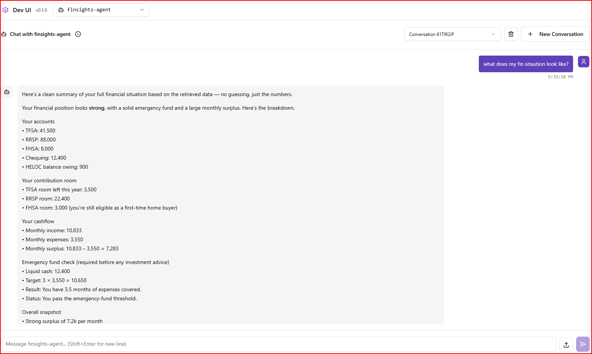

# FinSights

FinSights is an AI-powered Canadian personal finance assistant that helps users make practical decisions about saving, contribution room, emergency funds, and short-term planning. The solution combines multi-agent orchestration, structured financial tools, reusable skill playbooks, and a DevUI-based interaction surface so users can ask natural-language questions and get grounded, actionable answers.

This project was built for the Microsoft Reactor AI Dev Days Hackathon, focused on building real-world AI apps and agents with Microsoft technologies.

## Project Description

### Problem Solved

Personal finance guidance is often either too generic to be useful or too complex for everyday users to act on quickly. FinSights addresses that gap by turning a user's financial profile into decision-ready answers for questions like:

- How much contribution room is left in TFSA, RRSP, and FHSA?
- What is my current net worth?
- How much emergency fund coverage do I have?
- How long will it take to reach a savings goal?
- What should I do with a bonus or additional freelance income?

Instead of giving broad advice, the system uses structured financial data plus agent tools to produce responses tied to balances, contribution room, monthly cash flow, and scenario calculations.

### Features and Functionality

- Multi-agent finance assistant built with Microsoft Agent Framework primitives.
- Specialized finance agents for account insights and cash flow analysis.
- Orchestrator agent that delegates to specialists and loads domain playbooks from markdown skills.
- Structured financial tools for balances, registered-account room, emergency fund coverage, and savings projections.
- Seeded user financial profile for repeatable demos and scenario testing.
- DevUI as the primary interface for testing and asking questions to the agents.
- OpenAI-compatible endpoints for testing, evaluation, and future integrations.
- Aspire-based local orchestration for running the app host and agent service together.

### Technologies Used

- .NET 10
- .NET Aspire for local orchestration and service composition
- Microsoft Agent Framework via `Microsoft.Agents.AI`
- Azure-hosted LLM connectivity through the `llm` connection string
- Microsoft Foundry or Azure OpenAI compatible model endpoint support through the Azure chat client integration
- DevUI for interactive agent testing
- GitHub Copilot for rapid iteration on agent logic, tools, and documentation
- Markdown-based skill files for reusable financial guidance patterns

## Hackathon Submission Notes

This solution aligns with the hackathon theme of building AI apps and agents using Microsoft technologies:

- Microsoft Agent Framework is used to define the finance agents and orchestrator.
- Microsoft Foundry or Azure OpenAI compatible model endpoints can power the `llm` connection used by the agent service.
- Azure service integration is represented through the Azure chat completion client and Aspire-based configuration model.
- GitHub Copilot was used to accelerate implementation, refactoring, and documentation work.
- The orchestrator is already designed to accept additional AI functions, which provides a clean extension point for future MCP-based tool integration.

## Architecture Diagram



## Solution Architecture

### Core Components

- `apphost.cs` composes the distributed application using .NET Aspire.
- `FinSights.Agent` hosts the finance agents, DevUI, and OpenAI-compatible endpoints.
- `FinSights.ServiceDefaults` supplies shared Aspire defaults such as health endpoints.

### Agent Design

- `AccountsAgent` handles account balances, contribution room, and net worth calculations.
- `CashflowAgent` handles monthly surplus, emergency fund analysis, and savings goal projections.
- `finsights-agent` orchestrates both specialists and supplements them with markdown skill playbooks for contextual guidance.

### Data and Tools

- Financial context is loaded from a seeded profile in `src/FinSights.Agent/Data/maya.json`.
- Tool methods expose structured financial computations to the agent runtime.
- Skill playbooks in `src/FinSights.Agent/Skills` provide reusable guidance for common Canadian finance scenarios.

## Demo Scenarios

Use these prompts during judging or demos:

1. What's my current net worth?
2. How much TFSA, RRSP, and FHSA room do I still have?
3. How many months of emergency fund coverage do I have?
4. Can I reach my savings goal if I add $500 per month?
5. I got a $15,000 bonus. Where should it go first?
6. If I freelance for an extra $20,000, how much tax should I set aside?

## Running the Solution

Configure an `llm` connection string, then run the app host from the repository root:

```bash
dotnet run apphost.cs
```

This starts:

- `FinSights.Agent`
- Aspire-managed local orchestration and development endpoints

Use DevUI as the primary interface for testing and asking questions to the agents.

## Repository Structure

```text
apphost.cs
src/
	FinSights.Agent/
	FinSights.ServiceDefaults/
```

## Demo Screenshot


